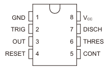
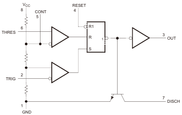

# 时钟和计时

- [ne555](#ne555)

## ne555

> [!NOTE]
> 

> [!NOTE]
> 

类型: **时基芯片**

- 稳态
  - 双稳态 : 稳定保持两种状态
  - 单稳态 : 只有一种状态
  - 无稳态 : 没有稳定状态

**RS触发器**

|S|R|Q|Q反|
|---|---|---|---|
|高|低|高|低|
|低|高|低|高|
|低|低|保持|保持|
|高|高|不稳定|不稳定|

> [!NTOE]
> RESET端口输入低电平时,触发器禁止使用(Q永远输出低电平)

**引脚视角看输入输出**

|2in|6in|3out|
|---|---|---|
|-|-|+|
|+|+|-|
|+|-|保持|
|-|+|不稳定|

- 当3脚低电平时,7脚低电平.3脚高电平时,7脚悬空
